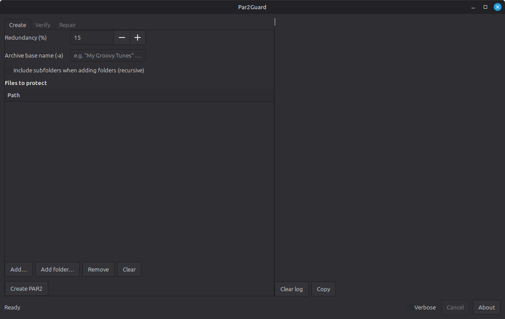

# Par2Guard

Par2Guard is a modern Python 3 GUI for creating, verifying, and repairing PAR2 parity files.

It is written in Python and designed to be cross-platform, though it is currently
tested primarily on Linux systems using GTK 3 (such as Linux Mint and Ubuntu).
Par2Guard acts as a clean and simple front-end to the standard `par2cmdline` tool.

Par2Guard is particularly useful for protecting large collections of data such as
music libraries, documents, archives, and backups against corruption or accidental
data loss.



---

## Features

- Create PAR2 parity files with configurable redundancy
- Verify existing PAR2 sets (single files or entire directory trees)
- Repair damaged or missing files when sufficient parity data exists
- Clean, readable logging with optional verbose output
- Clear end-of-run summaries showing:
  - items that are OK
  - items that require repair
  - items that were repaired or failed
- Automatically processes multiple folders (one PAR2 set per folder)
- GTK 3 desktop GUI
- Project-local configuration file (`config.ini`)

---

## Requirements

- Python 3.9 or newer
- GTK 3 with PyGObject
- `par2cmdline` (`par2`)

### Installing dependencies (Ubuntu / Linux Mint)

```bash
sudo apt install par2 python3-gi python3-gi-cairo gir1.2-gtk-3.0
```

---

## Installation

Par2Guard does not require installation and can be run directly from its folder.

```bash
git clone https://github.com/infidelus/par2guard.git
cd par2guard
chmod +x par2guard.py
./par2guard.py
```

On first run, a `config.ini` file will be created in the same directory.

---

## Configuration

Par2Guard uses a simple project-local configuration file named `config.ini`.

Example:

```ini
[defaults]
default_path=/home/youruser/Music
redundancy_percent=10
verbose_logging=0
```

### Configuration options

- `default_path`
  The starting folder used when file chooser dialogs open

- `redundancy_percent`
  Default redundancy percentage used when creating PAR2 files

- `verbose_logging`
  `0` for clean output
  `1` to show full PAR2 progress output

While the application is running, Par2Guard remembers the last folder used.
The `default_path` value is not overwritten automatically.

---

## Usage

### Creating PAR2 files

1. Open the Create tab
2. Add files or one or more folders
3. Choose the redundancy percentage
4. Click Create PAR2

If multiple folders are added, Par2Guard automatically creates one PAR2 set per
folder and stores the parity files inside each folder.

---

### Verifying files

1. Open the Verify tab
2. Add individual `.par2` files or scan a folder recursively
3. Click Verify

At the end of the run, Par2Guard displays a summary listing items that require repair.

---

### Repairing files

1. Open the Repair tab
2. Add `.par2` files or scan a folder recursively
3. Click Repair

Only the main `.par2` file is required. Associated `.vol*.par2` files are detected
automatically.

---

## Desktop Integration (Optional)

You can integrate Par2Guard into your desktop environment using a `.desktop` file.

Example `par2guard.desktop`:

```ini
[Desktop Entry]
Version=1.0
Type=Application
Name=Par2Guard
Comment=Create, verify and repair PAR2 parity files
Exec=/full/path/to/par2guard.py
Icon=/full/path/to/par2guard.png
Terminal=false
Categories=Utility;FileTools;
StartupNotify=true
```

Copy the file to:

```bash
~/.local/share/applications/
```

---

## About PAR2

PAR2 files are parity recovery files that allow damaged or missing data to be
reconstructed, provided enough recovery data exists. They are commonly used for
archives, backups, and large media collections.

Par2Guard uses the system `par2` / `par2cmdline` tool for all parity operations.

---

## Credits

Par2Guard is inspired by the original PyPAR2 project:

https://pypar2.fingelrest.net/

This project is not affiliated with PyPAR2. It exists to provide a modern Python 3
replacement with similar goals.

---

## License

Par2Guard is released under the MIT License.

See the LICENSE file for details.

---

## Status

Par2Guard is considered stable for regular use.
